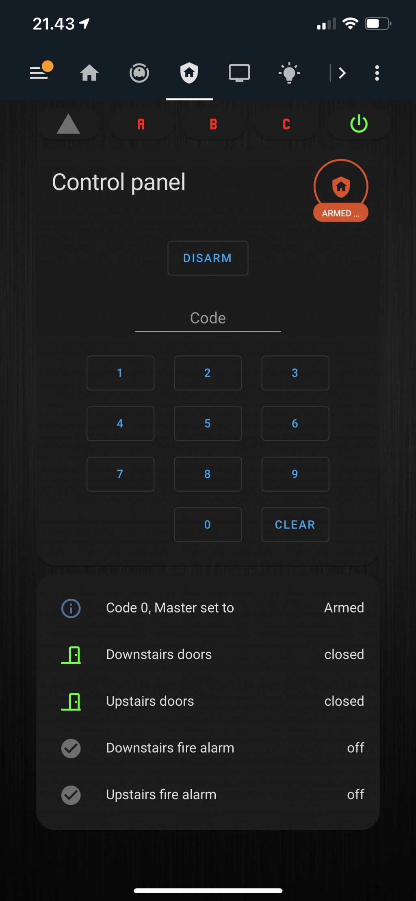

[](https://github.com/custom-components/hacs)

# jablotron80
Home Assistant custom component for JABLOTRON 80 alarm system

## Preparation

1. Connect the USB cable to Jablotron central unit
2. Restart the Home Assistant OS
3. Use the following command line to identify the port:

    ```
    $ dmesg | grep usb
    ```

    The cable should be connected as `/dev/hidraw[x]`, `/dev/ttyUSB0` or similar.

## Installation

### HACS

1. Just use [HACS](https://hacs.xyz/) (Home Assistant Community Store)  
    <small>*HACS is a third party community store and is not included in Home Assistant out of the box.*</small>

### Manual

1. [Download integration](https://github.com/tahvane1/jablotron80)
2. Copy the folder `custom_components/jablotron80` from the zip to your config directory
3. Restart Home Assistant
4. Jablotron integration should be available in the integrations UI

## Issues

Report [issue](https://github.com/tahvane1/jablotron80/issues)

## Supported devices

This integration has been tested with JA-80K central unit, JA-81F keypad and JA82-T usb cable. Tested sensors include wired door sensors and wired fire alarms.

## Examples & configuration

### Initial configuration
Integration support configuration flow via UI. 

It will ask for serial device to use and master passcode.
It will ask also for number of devices to be included as jablotron will by default have 50 devices (those could be configured off but at least in my case were not). This is just for convenience. 
Master passcode will be used to fetch configuration from central unit (device types, reactions, serial numbers, codes, arming without code). It will also be used to arm/disarm system if it is allowed without code in Home Assistant side (integration options).

### Configured integration


#### Devices
Integration will create one device per configured devices and additionally one for central unit (tamper alarm), one for connection and one for Home Assistant panel.


#### Entities

Integration will create one binary sensor per jablotron device, one for each led in keypad and one for each configured code. It will also create RF level sensor for RF signal and status sensor for each used zone.


Each sensor has additional state attributes depending in jablotron configuration.


#### Example control panel

Example alarm control panel defined in lovelace yaml

```
  - id:  security
    icon: mdi:shield-home
    title: Security
    cards:
        - type: vertical-stack
          cards:
          - type: horizontal-stack
            cards:
              - <<: *cb_spacer_10px
              - <<: *card_mod_margin_mainstyle
                type: "custom:button-card"
                entity: binary_sensor.ja_80k_alarm
                icon: mdi:triangle
                color_type: icon
                show_name: false
                show_state: false
                state:
                 - value: 'on'
                   color: rgb(255,5,5)
                   icon: mdi:hazard-lights
                 - value: 'off'
                   color: var(--disabled-text-color)
                   icon: mdi:triangle
              - <<: *card_mod_margin_mainstyle
                type: "custom:button-card"
                entity: binary_sensor.ja_80k_zone_a_armed
                icon: mdi:alpha-a
                color_type: icon
                show_name: false
                show_state: false
                state:
                 - value: 'on'
                   color: rgb(255,5,5)
                 - value: 'off'
                   color: var(--disabled-text-color)
              - <<: *card_mod_margin_mainstyle
                type: "custom:button-card"
                entity: binary_sensor.ja_80k_zone_b_armed
                icon: mdi:alpha-b
                color_type: icon
                show_name: false
                show_state: false
                state:
                 - value: 'on'
                   color: rgb(255,5,5)
                 - value: 'off'
                   color: var(--disabled-text-color)
              - <<: *card_mod_margin_mainstyle
                type: "custom:button-card"
                entity: binary_sensor.ja_80k_zone_c_armed
                icon: mdi:alpha-c
                color_type: icon
                show_name: false
                show_state: false
                state:
                 - value: 'on'
                   color: rgb(255,5,5)
                 - value: 'off'
                   color: var(--disabled-text-color)
              - <<: *card_mod_margin_mainstyle
                type: "custom:button-card"
                entity: binary_sensor.ja_80k_power
                icon: mdi:power
                color_type: icon
                show_name: false
                show_state: false
                state:
                 - value: 'on'
                   color: rgb(5,255,5)
                 - value: 'off'
                   color: var(--disabled-text-color)
              - <<: *cb_spacer_10px
              - <<: *cb_spacer_10px
           - type: horizontal-stack
            cards:
              - <<: *cb_spacer_10px
              - <<: *card_mod_margin_mainstyle
              - <<: *cb_spacer_10px

          - type: horizontal-stack
            cards:
              - <<: *cb_spacer_10px
              - <<: *card_mod_margin_mainstyle
                type: 'alarm-panel'
                entity: alarm_control_panel.jablotron_control_panel_abc
                name: Control panel
                states:
                  - arm_away
              - <<: *cb_spacer_10px
  
          - type: horizontal-stack
            cards:
              - <<: *cb_spacer_10px
              - <<: *card_mod_margin_mainstyle
                type: entities
                entities:
                  - entity: binary_sensor.doors_downstairs
                    name: Downstairs doors
                  - entity: binary_sensor.doors_upstairs
                    name: Upstairs doors
                  - entity: binary_sensor.firealarm_downstairs
                    name: Downstairs fire alarm
                  - entity: binary_sensor.firealarm_upstairs
                    name: Upstairs fire alarm
              - <<: *cb_spacer_10px
```

Screenshot of alarm control panel




## Credits

Thanks to [kukulich](https://github.com/kukulich/home-assistant-jablotron100), [fwpt](https://github.com/fwpt/HASS-Jablotron80-T/tree/master/custom_components/Jablotron80) and [mattsaxon](https://github.com/mattsaxon/HASS-Jablotron80) for figuring out Jablotron functionality and Home Assistant essentials.
