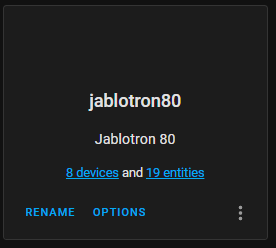
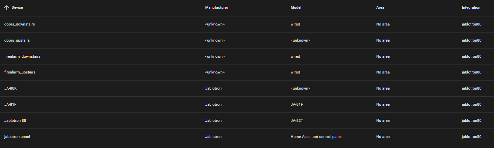
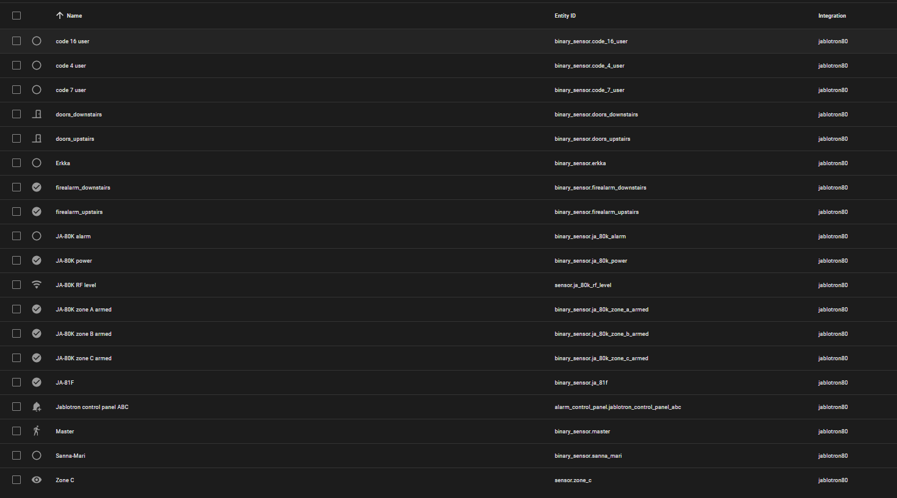
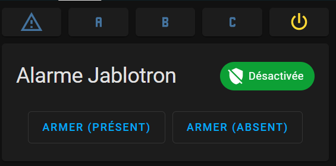
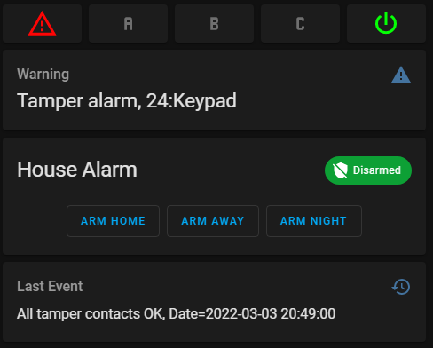

[](https://github.com/custom-components/hacs)

# jablotron80
Home Assistant custom component for JABLOTRON 80 alarm system

## Preparation

1. Connect the USB or Serial cable to Jablotron central unit
2. Restart the Home Assistant OS
3. Use the following command line to identify the port:

    ```
    $ dmesg | grep usb
    ```

    The cable should be connected as `/dev/hidraw[x]`, `/dev/ttyUSB0` or similar.

## Installation

### HACS

1. Just use [HACS](https://hacs.xyz/) (Home Assistant Community Store)  
    <small>*HACS is a third party community store and is not included in Home Assistant out of the box.*</small>

### Manual

1. [Download integration](https://github.com/tahvane1/jablotron80)
2. Copy the folder `custom_components/jablotron80` from the zip to your config directory
3. Restart Home Assistant
4. Jablotron integration should be available in the integrations UI

## Issues

Report [issue](https://github.com/tahvane1/jablotron80/issues)

## Supported devices

This integration has been tested with JA-80K /JA-82K central units, JA-81F keypad and both JA-82T usb and JA-80T serial cables.
Tested sensors include wired/wireless PIRs & door sensors and wired/wireless fire alarms.

## Remote Support
The JA-80T serial cable setup can work with remote serial devices using a device address of 'socket://[ipaddress:socket]' (e.g. socket://192.168.0.1:23) , see section at bottom of page for more details. This can be made to work even without a JA-80T serial cable (as these are hard to source).
It does also work with a tool called usbipd, 'duplicating' the /dev/hidraw0 device from a server connected to the jablotron alarm to the homeassistant client machine.

## Examples & configuration

### Initial configuration
Integration support configuration flow via UI. 

It will ask for serial device to use and master passcode.
It will ask also for number of devices to be included as jablotron will by default have 50 devices (those could be configured off but at least in my case were not). This is just for convenience. 
Master passcode will be used to fetch configuration from central unit (device types, reactions, serial numbers, codes, arming without code). It will also be used to arm/disarm system if it is allowed without code in Home Assistant side (integration options).

### Configured integration



#### Devices
Integration will create one device per configured devices and additionally one for central unit (tamper alarm), one for connection and one for Home Assistant panel.




#### Entities

Integration will create one binary sensor per jablotron device, one for each led in keypad and one for each configured code. It will also create RF level sensor for RF signal and status sensor for each used zone.



Each sensor has additional state attributes depending in jablotron configuration.


#### Example control panel

Example of a configuration in lovelace which attempts to reproduce the Jablotron panel on top of the standard home assistant alarm panel: 

```
type: vertical-stack
cards:
  - type: horizontal-stack
    cards:
      - type: button
        entity: binary_sensor.ja_80k_alarm
        icon: mdi:alert-outline
        color_type: icon
        show_name: false
        show_state: false
        state:
          - value: 'on'
            color: rgb(255,5,5)
          - value: 'off'
            color: var(--disabled-text-color)
        tap_action:
          action: call-service
          service: button.press
          service_data:
            entity_id: button.ja_80k_query_button
      - type: button
        entity: binary_sensor.ja_80k_zone_a_armed
        icon: mdi:alpha-a
        color_type: icon
        show_name: false
        show_state: false
        state:
          - value: 'on'
            color: rgb(255,5,5)
          - value: 'off'
            color: var(--disabled-text-color)
      - type: button
        entity: binary_sensor.ja_80k_zone_b_armed
        icon: mdi:alpha-b
        color_type: icon
        show_name: false
        show_state: false
        state:
          - value: 'on'
            color: rgb(255,5,5)
          - value: 'off'
            color: var(--disabled-text-color)
      - type: button
        entity: binary_sensor.ja_80k_zone_c_armed
        icon: mdi:alpha-c
        color_type: icon
        show_name: false
        show_state: false
        state:
          - value: 'on'
            color: rgb(255,5,5)
          - value: 'off'
            color: var(--disabled-text-color)
      - type: button
        entity: binary_sensor.ja_80k_power
        icon: mdi:power
        color_type: icon
        show_name: false
        show_state: false
        state:
          - value: 'on'
            color: rgb(5,255,5)
          - value: 'off'
            color: var(--disabled-text-color)
  - type: conditional
    conditions:
      - entity: sensor.ja_80k_alert
        state_not: OK
    card:
      type: entity
      entity: sensor.ja_80k_alert
      attribute: message
      name: Alert
      state_color: false
      icon: mdi:alert
      style: |
        ha-card
        .value {
          font-size: 22px
        }
  - type: conditional
    conditions:
      - entity: binary_sensor.ja_80k_status_text
        state: 'on'
    card:
      type: entity
      entity: binary_sensor.ja_80k_status_text
      icon: mdi:information
      name: Keypad Message
      attribute: message
  - type: alarm-panel
    states:
      - arm_home
      - arm_away
      - arm_night
    entity: alarm_control_panel.jablotron_control_panel_a_ab_abc
    name: House Alarm
  - type: entity
    entity: binary_sensor.ja_80k_control_panel
    attribute: last event
    name: Last Event
    icon: mdi:history
    style: |
      ha-card
      .value {
        font-size: 16px
      }
```

Screenshot of alarm control panel




#### Enhanced control panel

If you would like to enhance the example with coloured buttons and flashing Warning and Power 'leds' and are prepared to install the custom button card https://github.com/custom-cards/button-card (installable via HACS), you can use the following snippet

Screenshot of enhanced alarm control panel



```
type: horizontal-stack
cards:
  - type: custom:button-card
    entity: sensor.ja_80k_alert
    icon: mdi:alert-outline
    color_type: icon
    show_name: false
    show_state: false
    state:
      - value: Fault
        color: rgb(255,5,5)
      - value: Alarm
        color: rgb(255,5,5)
        styles:
          card:
            - animation: blink 2s ease infinite
      - value: OK
        color: var(--disabled-text-color)
    tap_action:
      action: call-service
      service: button.press
      service_data:
        entity_id: button.ja_80k_query_button
    hold_action:
      action: more-info
  - type: custom:button-card
    entity: binary_sensor.ja_80k_zone_a_armed
    icon: mdi:alpha-a
    color_type: icon
    show_name: false
    show_state: false
    state:
      - value: 'on'
        color: rgb(255,5,5)
      - value: 'off'
        color: var(--disabled-text-color)
  - type: custom:button-card
    entity: binary_sensor.ja_80k_zone_b_armed
    icon: mdi:alpha-b
    color_type: icon
    show_name: false
    show_state: false
    state:
      - value: 'on'
        color: rgb(255,5,5)
      - value: 'off'
        color: var(--disabled-text-color)
  - type: custom:button-card
    entity: binary_sensor.ja_80k_zone_c_armed
    icon: mdi:alpha-c
    color_type: icon
    show_name: false
    show_state: false
    state:
      - value: 'on'
        color: rgb(255,5,5)
      - value: 'off'
        color: var(--disabled-text-color)
  - type: custom:button-card
    entity: binary_sensor.ja_80k_power
    icon: mdi:power
    color_type: icon
    show_name: false
    show_state: false
    state:
      - value: 'on'
        color: rgb(5,255,5)
      - value: 'off'
        color: rgb(5,255,5)
        styles:
          card:
            - animation: blink 2s ease infinite

```

## Remote
Generic remote serial devices are expected to be able to be made to work with this integration.

A confirmed workinging confiuration is documented below:

|Description   |Supplier   |Part Number   |Comment   |URL/Search Terms   |
|---|---|---|---|---|
|TTL to Ethernet Converter|USR IOT Technology Limited  |USR-TCP232-T2|Direct connection prefered as opposed to WiFi for performance|   |
|TTL to RS485 converter|MAX|MAX3485||
|3.3V or 5v step down power transformer|||Connected to the 12V power supply on the Jablotron board||

Serial Port to be setup as `9600 baud, 8 bit, no partity, 1 stop bit`. Must be set-up as `TCP Server`

Additional expected similar solutions could be constructed from USR-TCP232-306, USR-TCP232-304 connected directly to the control panel or
USR-TCP232-302 conected to an existing JA-80T serial cable.

Another solution for remote usage could be via the use of a tool called ```usbip``` that needs to be installed on the server **(jablotron alarm side)** and the client **(homeassistant running this repo.)**

First using the following command ```dmesg | grep hid``` on the **server** to check if (in this case JA-82T) is visible:
```
[8740307.349070] hid-generic 0003:16D6:0007.0002: hiddev96,hidraw0: USB HID v1.11 Device [JABLOTRON ALARMS JA-82T PC Interface] on usb-0000:01:00.0-1.3/input0
```
Now we know the device we are looking for is hidraw0 and the ID **16D6:0007**, by the way the ID can also be optained if the command ```lsusb``` is executed
```
Bus 001 Device 013: ID 16d6:0007 JABLOCOM s.r.o. JA-82T PC Interface
```

As stated installation of usbip needs to be done on the **Server** and **CLient**

Server:
```
sudo apt install usbip hwdata usbutils
modprobe usbip_host
echo 'usbip_host' >> /etc/modules

# Create a systemd service
nano /lib/systemd/system/usbipd.service
```

The file usbipd.service should contain. 
```
[Unit]
Description=usbip host daemon
After=network.target

[Service]
Type=forking
ExecStart=/usr/sbin/usbipd -D
ExecStartPost=/bin/sh -c "/usr/sbin/usbip bind --$(/usr/sbin/usbip list -p -l | grep '#usbid=16d6:0007#' | cut '-d#' -f1)"
ExecStop=/bin/sh -c "/usr/sbin/usbip unbind --$(/usr/sbin/usbip list -p -l | grep '#usbid=16d6:0007#' | cut '-d#' -f1); killall usbipd"

[Install]
WantedBy=multi-user.target

```
Only change the #usbid=16d6:0007# if necessary.
Save the file and execute:
```
# reload systemd, enable, then start the service
sudo systemctl --system daemon-reload
sudo systemctl enable usbipd.service
sudo systemctl start usbipd.service
```
The server setup is now complete, move over to the client

Client:
```
sudo apt install usbip hwdata usbutils
modprobe vhci-hcd
echo 'vhci-hcd' >> /etc/modules

# Create a systemd service
nano /lib/systemd/system/usbip.service
```

Much like we did on the server, we’re going to need to modify the ExecStart and ExecStop lines below to search for the correct USB device ID that’s being presented by your USB/IP server. Likewise, change the IP 192.168.0.10 to match your server.
```
[Unit]
Description=usbip client
After=network.target

[Service]
Type=oneshot
RemainAfterExit=yes
ExecStart=/bin/sh -c "/usr/sbin/usbip attach -r 192.168.0.10 -b $(/usr/sbin/usbip list -r 192.168.0.10 | grep '16d6:0007' | cut -d: -f1)"
ExecStop=/bin/sh -c "/usr/sbin/usbip detach --port=$(/usr/sbin/usbip port | grep '<Port in Use>' | sed -E 's/^Port ([0-9][0-9]).*/\1/')"

[Install]
WantedBy=multi-user.target
```

Save that file, then run the following commands in your shell:

```
# reload systemd, enable, then start the service
sudo systemctl --system daemon-reload
sudo systemctl enable usbip.service
sudo systemctl start usbip.service
```

You should now be able to access the USB device on the client as if the device was plugged in locally, ```(ls -l /dev/hidraw0)``` and you have an auto-starting systemd service to control things.)

Thanks to [derushadigital.com](https://derushadigital.com/other%20projects/2019/02/19/RPi-USBIP-ZWave.html) 

For Docker users we need to add the following to the docker_compose file to enable homeassistant to use this device:

    devices:
      - /dev/hidraw0

Restart your homeassistant docker and you are able to complete the repo configuration from within homeassistant using the virtual /dev/hidraw0.

## Troubleshooting

Additional logging can be enabled in configuration.yaml

```
logger:
 logs:
   custom_components.jablotron80: debug
```
Raw data send by cable can be seen in logs by setting above and uncommentting following lines in jablotron.py (around line number )
```
			#UNCOMMENT THESE LINES TO SEE RAW DATA (produces a lot of logs)
			#if LOGGER.isEnabledFor(logging.DEBUG):
			#	formatted_data = " ".join(["%02x" % c for c in data])
			#	LOGGER.debug(f'Received raw data {formatted_data}')
```
## Credits

Thanks to [kukulich](https://github.com/kukulich/home-assistant-jablotron100), [fwpt](https://github.com/fwpt/HASS-Jablotron80-T/tree/master/custom_components/Jablotron80) and [mattsaxon](https://github.com/mattsaxon/HASS-Jablotron80) for figuring out Jablotron functionality and Home Assistant essentials.
